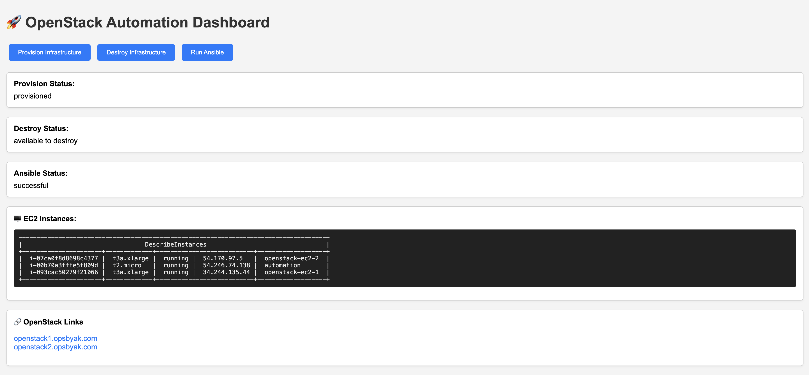
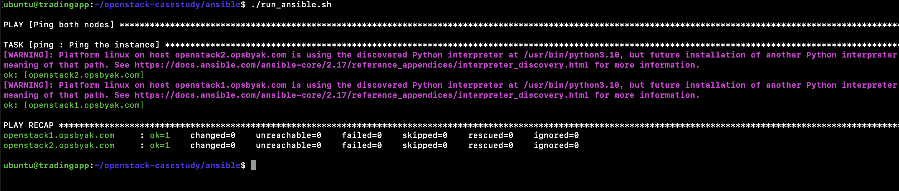

# Openstack casestudy

This repository contains for provisioning of OpenStack on EC2 instance using Ansible.

---

### 🖱️ How to Use the Dashboard
To Avoid Cost on my end, I created this small dashboard to spin up infrastrucutre and destroy on demand for.
Dashboard is running and accessible at [https://automation.opsbyak.com](https://automation.opsbyak.com), here's how to use it:



---

#### 🔘 1. Provision Infrastructure

- Click the **"Provision Infrastructure"** button.
- This triggers `provision.sh` in the background using Terraform.
- **Status will update** from `not started` → `running` → `provisioned` once completed.
- If it's already running, clicking the button will show `already_running`.

---

#### 🗑️ 2. Destroy Infrastructure

- Click the **"Destroy Infrastructure"** button.
- This runs `destroy.sh` to destroy the Terraform-managed resources.
- **Status will update** to `destroyed`.
- It also automatically clears the **provision status**.

---

#### 🧰 3. Run Ansible

- Click the **"Run Ansible"** button.
- This executes `run_ansible.sh`, which runs `ansible-playbook playbook.yaml`.
- **Status will update** to `successful` once the playbook finishes.

---

#### ☁️ 4. View EC2 Instances

- Scroll down to the **"EC2 Instances"** section.
- The list auto-refreshes on every page load.
- It shows instance ID, type, state, IP, and Name tag via AWS CLI.

---

#### 🔗 5. OpenStack Links

- Two static links are provided at the bottom:
  - [https://openstack1.opsbyak.com](https://openstack1.opsbyak.com)
  - [https://openstack2.opsbyak.com](https://openstack2.opsbyak.com)

These open in a new tab for convenience.

---

#### 🔄 6. Refresh Statuses

- Refreshing the page will **not trigger any new actions**.
- It will **only re-fetch the current statuses** from status files and re-display them.
- You can safely refresh to monitor ongoing operations.

---

#### ⚠️ Notes

- No logs are shown in the UI by design — this is a **status-only dashboard**.

---
## Infrastructure Deployment

For full provisioning instructions and details, please refer to:

➡️ [terraform-openstack-ec2/README.md](terraform-openstack-ec2/README.md)

## OpenStack Deployment

This setup provisions and configures a two-node OpenStack environment using Ansible. The architecture splits the OpenStack services across two EC2 instances for simulated high availability and scalability.

---

### Node Roles

#### 1. Controller Node (`openstack1.opsbyak.com`)
- **Role:** Controller
- **Services Installed:**
  - Keystone (Identity)
  - Glance (Image Service)
  - Nova API + Scheduler
  - Neutron (Controller-side)
  - Horizon (Dashboard)
  - Trove (Database Service)
  - Swift (Object Storage)

#### 2. Compute Node (`openstack2.opsbyak.com`)
- **Role:** Compute
- **Services Installed:**
  - Nova Compute
  - Neutron Agent

---

### Ansible Directory Structure

```
ansible/
├── ansible.cfg
├── group_vars/
│   └── all.yml
├── inventory
├── install_devstack_split.yml
└── roles/
    ├── ping/
    │   └── tasks/main.yml
    ├── devstack_controller/
    │   ├── tasks/main.yml
    │   └── templates/local.conf.j2
    └── devstack_compute/
        ├── tasks/main.yml
        └── templates/local.conf.j2
```

---

### Playbook: `playbook.yml`

This playbook does the following:

1. **Ping Test (all hosts)**: Verifies both controller and compute nodes are reachable via SSH.
2. **Controller Setup**: Installs dependencies, clones DevStack, applies the controller-specific local.conf, and runs stack.sh.
3. **Compute Setup**: Installs dependencies, clones DevStack, applies the compute-specific local.conf, and runs stack.sh.

---

### Inventory Configuration

```ini
[controller]
openstack1.opsbyak.com ansible_user=ubuntu

[compute]
openstack2.opsbyak.com ansible_user=ubuntu
```

---

### DevStack Configuration Templates

#### Controller (`local.conf.j2`)
- Enables full services like Nova API, Glance, Neutron, Trove, Swift, Horizon
- `HOST_IP` is the public IP of the controller
- `MULTI_HOST=true` is enabled

#### Compute (`local.conf.j2`)
- Enables Nova Compute and Neutron Agent only
- `SERVICE_HOST` is the controller’s public IP
- `HOST_IP` is the compute node's public IP

---

### How to Run

```bash
./run_ansible.sh
```

Ensure:
- Both DNS entries (`openstack1.opsbyak.com`, `openstack2.opsbyak.com`) resolve correctly
- Internal traffic is allowed between EC2s
- SSH access is configured in `group_vars/all.yml`

---

### Outcome

- Full OpenStack environment deployed
- Simulated high-availability and scalability using two nodes
- Services split effectively between controller and compute

---

Once Infra provisioned simply running ansible script will ping pong status (This was done for testing purpose only): 
